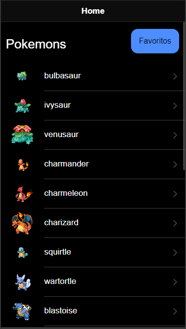
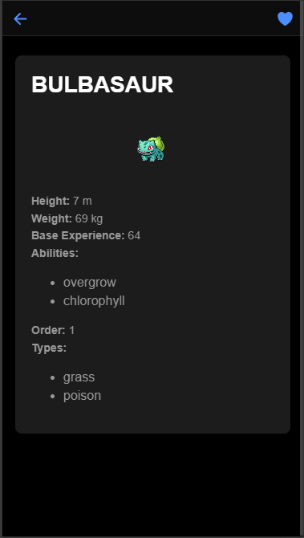
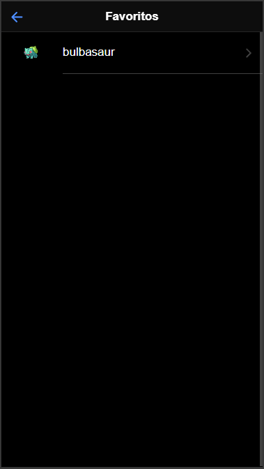

# Pokémon App

Este projeto é um aplicativo de listagem e detalhamento de Pokémons, desenvolvido com Ionic e Angular. O aplicativo possui três telas principais: Home, Details-Pokemon e Favorites.

## Sumário

- [Instalação](#instalação)
- [Uso](#uso)
- [Telas](#telas)
  - [Home](#home)
  - [Details-Pokemon](#details-pokemon)
  - [Favorites](#favorites)
- [Imagens](#imagens)
- [Comentários](#comentários)

## Instalação

Clone o repositório e instale as dependências:

```bash
git clone https://github.com/4d4m0r/pokeApi.git
cd pokeApi
npm install
````

## Uso

Inicie o servidor de desenvolvimento:

```bash
ionic serve
````

## Telas

**Home**<br>
A tela Home é responsável por exibir uma lista de Pokémons. Cada item da lista pode ser clicado para acessar a tela de detalhes do Pokémon. Há também um botão de favoritos que leva à tela de favoritos.
Funcionalidades:
- Exibir uma lista de Pokémons.
- Navegar para a tela de detalhes do Pokémon.
- Botão de acesso rápido aos favoritos.

**Details-Pokemon**<br>
A tela Details-Pokemon exibe informações detalhadas sobre um Pokémon selecionado.Também possui um botão para favoritar o Pokémon.
Funcionalidades:
- Exibir detalhes do Pokémon selecionado.
- Botão para favoritar o Pokémon.

**Pokemon-Favs**<br>
A tela Pokemon-Favs exibe todos os Pokémons que foram favoritados. Cada Pokémon favoritado pode ser visualizado novamente na tela de detalhes.
Funcionalidades:
- Exibir lista de Pokémons favoritados.
- Navegar para a tela de detalhes do Pokémon favoritado.

# Imagens
<table>
    <tr>
        <td>Home</td>
        <td>Pokemon Details</td>
        <td>Pokemon Favorites</td>
    </tr>
    <tr>
        <td></td>
         <td></td>
        <td>
    </tr>
</table>
<br><br>

# Comentários
1. Dado a API disponível me preocupei primeiramente em fazer um service que fosse capaz de retornar dados a partir da url mais simples, finalizando assim o escopo 1.
2. Após isso pude focar na manipulação desses dados e conseguir trabalhar em outra página mais elaborada, com mais detalhes sobre cada pokémon, finalizando o escopo 2 e 3.
3. Foquei em 2 serviços,api.service.ts, responsável pela coleta de informações sobre os pokémons e o favorites.service.ts, responsável pelo armazenamento dos pokémons favoritados durante a sessão.
4. Ao todo montei 3 páginas, sendo elas a página principal home, responsável pela exibição do nome e imagens dos pokémons, a página pokemon-details, responsável pela visualização mais detalhada de algum pokémon selecionado pelo usuário e por fim a página pokemon-favs, responsável pela exibição dos pokémons favoritados.
5. Para melhor usabilidade adicionei um componente que permite o usuário voltar para a página anterior.
6. Adicionei comentários ao estilo jsDoc, mas tive dificuldades de utilizar a geração da visualização web.